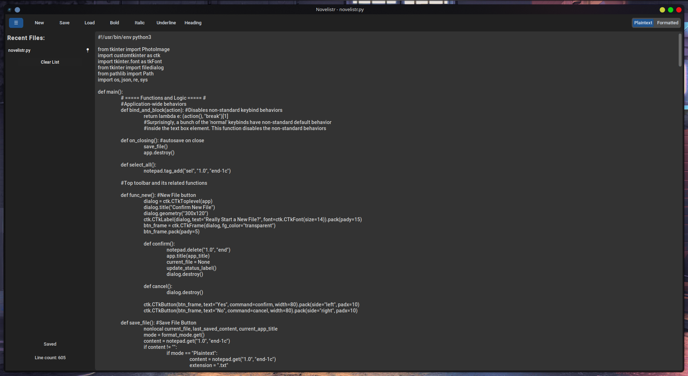

# ✨ Novelistr
Novelistr is a modern, minimalist writing tool built with Python and CustomTkinter. Whether you're drafting a novel, jotting quick notes, or writing code, Novelistr blends power and simplicity with style.



# 🚀 Features
📝 Dual Writing Modes

__Plaintext Mode__: Ideal for coding, notes, and general writing. Line count shown in the bottom left.

__Formatted Mode__: Markdown-flavored WYSIWYG editor with visual tags for bold, italic, underline, and headings. Word count shown in the bottom left.

### 💾 Autosave

Autosave every minute and on close. 

User-defined intervals coming soon!

### 🕹️ Keyboard Shortcuts

- Ctrl/Cmd + N: New File
- Ctrl/Cmd + S: Save File
- Ctrl/Cmd + O: Load File
- Ctrl/Cmd + B: Bold
- Ctrl/Cmd + I: Italic
- Ctrl/Cmd + U: Underline
- Ctrl/Cmd + H: Heading
- Ctrl/Cmd + M: Toggle Plaintext/Formatted Mode
- Ctrl/Cmd + A: Select All
- Ctrl/Cmd + Z: Undo
- Ctrl/Cmd + Y: Redo

### 📁 Collapsible Recent Files Panel

Automatically logs recently opened/saved files.

Pin your favorites for quick access.

Clear the list easily.

# 📦 Installation
### Option 1: Run Portable Binary Executable

Download the standalone Novelistr binary (it has no file extension) and double click it.

> [!NOTE]
> End users that wish to properly install the portable binary, 
> so it shows up in your system's menus and launchers,
> should follow Option 4, below.

### Option 2: .deb (Recommended for Debian/Ubuntu/Pop!/Mint users)

Download the novelistr.deb file. `cd` to the download location and run:

```
sudo dpkg -i novelistr_X.X.X_.amd64.deb
```

### Option 3: flatpak (Recommended for flatpak users)

Download the novelistr.flatpak file. `cd` to the download location and run:
```
flatpak install ./novelistr.flatpak
```

### Option 4: Installing the Portable Binary Executable (Advanced Users)

 - Download the standalone Novelistr binary, and novelistr.desktop, and the icon of their choice (icon_*Y*x*Y*.png), both found in the assets/ directory.

 - Place the binary in `$HOME/.local/bin/`

 - Place novelistr.desktop in `$HOME/.local/share/applications`

 - Place the .png file in the appropriate directory in `/home/datavikingr/.local/share/icons/hicolor/`. 

 - Rename the image to `novelistr.png`

### Option 5: Run from Source (Python officianados)
```
git clone https://github.com/your-username/novelistr
cd novelistr
pip install -r requirements.txt
python novelistr.py
```

# 🛠️ Build Instructions (PyInstaller)

Download the dependency:
```
pip install pyinstaller
```

Create a standalone executable:

```
pyinstaller --onefile --noconfirm --windowed \
  --icon=assets/icon_32x32.png \
  --add-data "assets:assets" \
  --hidden-import=customtkinter \
  novelistr.py
```

# 🗂 File Structure
novelistr.py: Main application

assets/: Contains icons, novelistr.desktop

$HOME/.novelistr/recent.json: Recent files log (auto-generated)

flatpak/: file structure required for flatpak bundling

tools/: the entire build pipeline, produces binary, .deb, .flatpak.

# 📄 License
Licensed under the MIT License. See LICENSE for details.

# 🧙‍♂️ Author's Note
Crafted with love, coffee, and some head-scratching over Tkinter’s quirks. This project evolved with daily iteration, and serves both as a novel-writing tool and a code editor. Your feedback, forks, and stars are welcome.

# Roadmap
- [ ] Flathub submission and related cleanup/tweaks
- [ ] git integration in build pipeline
- [ ] Mono font in plaintext mode, non-mono font in formatted
- [ ] User Settings Dialog
- [ ] Theming support
- [ ] .pkg, .exe packaging (Mac and Windows support)
- [ ] Export .md/.txt to .rtf
- [ ] Syntax highlighting in Plaintext mode
- [ ] Resolve quirk surrounding keybind-Save reporting Saved briefly and then reverting to Unsaved after key release