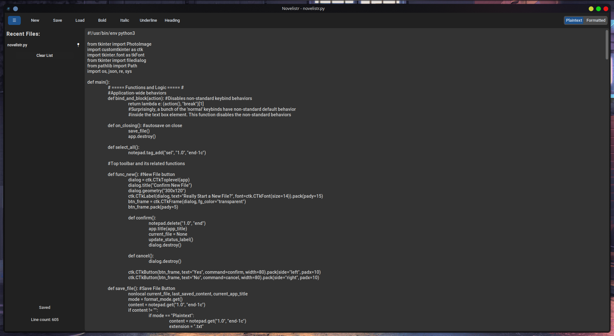

# ✨ Novelistr
Novelistr is a modern, minimalist writing tool built with Python and CustomTkinter. Whether you're drafting a novel, jotting quick notes, or organizing markdown-formatted documents, Novelistr blends power and simplicity with style.



# 🚀 Features
📝 Dual Writing Modes

__Plaintext Mode__: Ideal for coding, notes, and general writing. Line count shown.

__Formatted Mode__: Markdown-flavored WYSIWYG editor with visual tags for bold, italic, underline, and headings. Word count shown.

### 💾 Autosave

Autosave every minute and on close. 

User-defined intervals coming soon!

### 🎨 Theming & Styling

Dark theme (CustomTkinter "dark-blue").

Resizable, user-friendly UI.

Font customization and visual formatting tags.

### 🕹️ Keyboard Shortcuts

- Ctrl/Cmd + N: New File
- Ctrl/Cmd + S: Save File
- Ctrl/Cmd + O: Load File
- Ctrl/Cmd + B: Bold
- Ctrl/Cmd + I: Italic
- Ctrl/Cmd + U: Underline
- Ctrl/Cmd + H: Heading
- Ctrl/Cmd + M: Toggle Plaintext/Formatted Mode
- Ctrl/Cmd + A: Select All
- Ctrl/Cmd + Z: Undo
- Ctrl/Cmd + Y: Redo

### 📁 Collapsible Recent Files Panel

Automatically logs opened/saved files.

Pin your favorites for quick access.

Clear list easily.

### 📌 Cross-Platform

Built for Linux, Windows, and macOS using Python 3.12+.

# 📦 Installation
### Option 1: Binary Executable (Recommended for end users)

Download the standalone Novelistr binary and double click it!

Other formats .exe, .deb, .pkg coming soon!

### Option 2: Run from Source
```
git clone https://github.com/your-username/novelistr
cd novelistr
pip install -r requirements.txt
python novelistr.py
```

# 🛠️ Build Instructions (PyInstaller)
To create a standalone executable:

```
pyinstaller --onefile --noconfirm --windowed \
  --icon=assets/icon_32x32.png \
  --add-data "assets:assets" \
  --hidden-import=customtkinter \
  novelistr.py
```

For Linux .deb packaging or pip distribution, see setup.cfg and pyproject.toml (coming soon).

# 🗂 File Structure
novelistr.py: Main application

assets/: Contains icons

~/.novelistr/recent.json: Recent files log (auto-generated)

# 📄 License
Licensed under the MIT License. See LICENSE for details.

# 🧙‍♂️ Author's Note
Crafted with love, coffee, and some head-scratching over Tkinter’s quirks. This project evolved with daily iteration, and serves both as a novel-writing tool and a code editor. Your feedback, forks, and stars are welcome.

# Roadmap
- [ ] User Settings Dialog
- [ ] Theming support
- [ ] .deb, .pkg, .exe packaging
- [ ] Export to .rtf
- [ ] Syntax highlighting in Plaintext mode
- [ ] Resolve quirk surrounding keybind-Save reporting saved briefly and then unsaved after key release